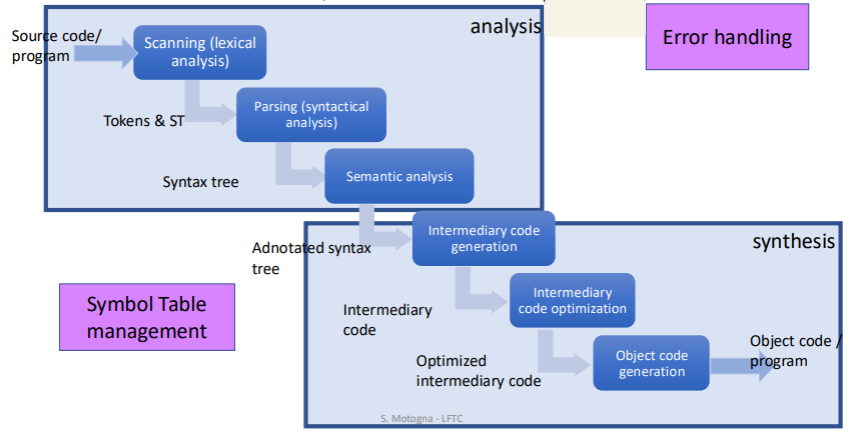
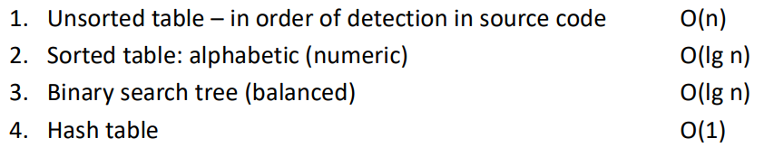

# Course 1

## Structure of a compiler

 


## 1. Scanning

- detect tokens
- classify tokens
- codify tokens

---

### Remark 1:
No matter how many separators (spaces, tabs, newlines) are between tokens, they are treated as a single separator.

---

### Remark 2:
Lookahead: the compiler will try to consume as many characters as possible to form a valid token.

#### Example:
Difference between `=` and `==`:
```
if (x == y) {x = y + 2};
```

`if` - reserved word  
`(` - separator  
`x` - identifier  
`==` - relational operator  
`y` - identifier  
`)` - separator  
`{` - separator  
`x` - identifier  
`=` - assignment operator  
`y` - identifier  
`+` - arithmetic operator  
`2` - integer constant    
`}` - separator 

---

### Operstors can be:
- arithmetic
- logical
- relational

---

### Classes of tokens:
- identifiers
- constants
- reserved words
- separators
- operators

If a token cannot be classified => lexical error.

---

### Codify:
Symbol Table (ST) & Program Internal Form (PIF)
- ST: stores identifiers and constants
- PIF: stores pairs (token, ST position) for identifiers and constants

#### ST:
Complexities:

