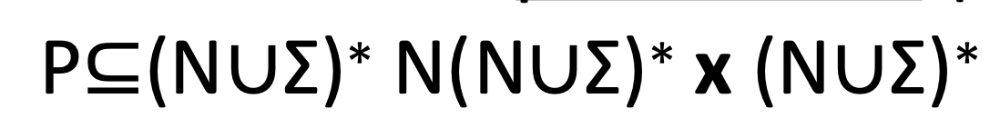

# Course 2

## 1. LEX lexical analyzer  
- in Unix
- generates C code
- output file: lex.yy.c  


### Input file format
- extension: `.lxi` (recommended)
```
<definitions>
%%
<rules>
%%
<user code>
```

**Example:**  
specifies that whenever the string "username" is found in the input, it should be replaced with the output of the function `getlogin()`
```
username printf("%s", getlogin());
```

### 1. Definitions section
Format:
```
<name> <definition>
```
- `<name>`: identifier for the definition, without spaces
- `<definition>`: regular expression

### 2. Rules section
Format:
```
<pattern> <action>
```
- `<pattern>`: regular expression to match input text
- `<action>`: 
    - C code to execute when the pattern is matched
    - `yytext`: current token (matched text)

### 3. User code section
- optional
- copied directly to the end of the generated C file

### [RegExp File](https://ubbcluj.sharepoint.com/:w:/s/CS-FormalLanguagesandCompilerDesign/ERc9AXvShFxEnGUi90H8E-EBX606lh9Md1k-7eQp6j0pxw?e=q0Xnz9)

### [LEX Example](https://ubbcluj.sharepoint.com/:w:/s/CS-FormalLanguagesandCompilerDesign/EVadlLXzu2VOiA6uRwkM-SsBEq8Otnd2v5REyuq8B_mxqQ?e=IfPd4L)

### Naming conventions:
- `yy` prefix: LEX/YACC generated functions and variables
- `yylex()`: main function to perform lexical analysis
- `yyin`: input file pointer (default: stdin)
- `yyout`: output file pointer (default: stdout)

### Running LEX
```
lex spec.lxi
gcc lex.yy.c -o your_lex
./your_lex < input.txt
```

## 2. Formal Languages - basic notions

- formal language = set

- P – finite set of **productions**
  
Cross product between:
    - a combination of symbols, out of which at least one non-terminal symbol
    - a combination of symbols

### Chomsky hierarchy
- Type 0: Unrestricted grammars
- Type 1: Context-sensitive grammars    ($x_1Ay_1 → x_1γy_1$  (context of $A$ is $x_1 \_ y_1$))
- Type 2: Context-free grammars         ($A \rightarrow \alpha$, where $A$ is a non-terminal and $\alpha$ is any string of terminals and/or non-terminals)
- Type 3: Regular grammars              ($A \rightarrow aB$  or  $A \rightarrow a$)

Type 3 $\subseteq$ Type 2 $\subseteq$ Type 1 $\subseteq$ Type 0


## Regular Grammars (RG)
A regular grammar is a grammar $G = (N, \Sigma, P, S)$ where 
- every production has one of the forms 
    - $A \rightarrow aB$
    - $A \rightarrow a$,  

    with $A, B \in N$ (nonterminals) and $a \in \Sigma$ (terminals),
- (optionally) $S \rightarrow \varepsilon$ is allowed only if $S$ does not appear on the right side of any production ($\nexists$ $\_ \rightarrow \_S\_$).