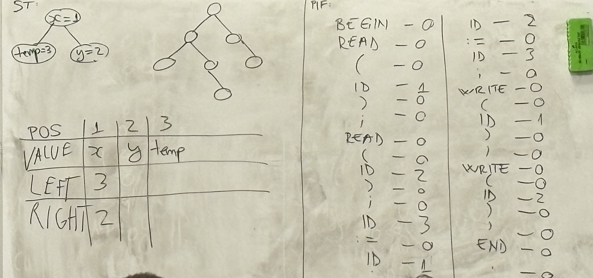
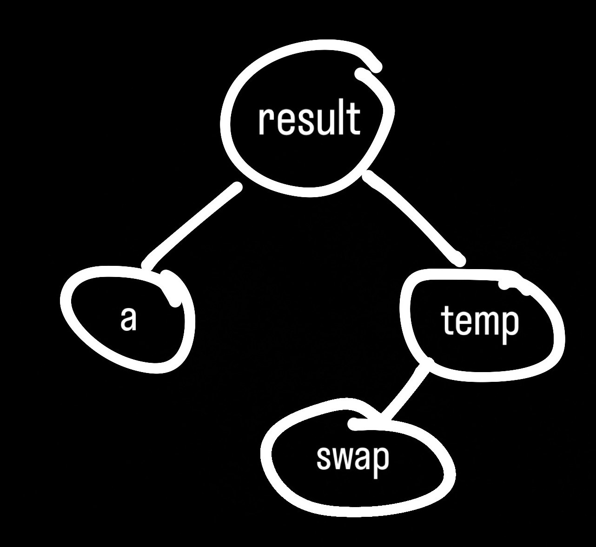

# Seminar 2 - Lexical Analysis

## Example 1:

`if (x == y)`
- `if` - keyword
- `(` - punctuation
- `x` - identifier
- `==` - operator
- `y` - identifier
- `)` - punctuation


### Symbol Table (ST)
|       |       |
|-------|-------|
| `x`   | 1     |
| `y`   | 2     |

### PIF = Program Internal Form
|       |   |
|-------|---|
| if    | 0 |
| (     | 0 |
| ID    | 1 |
| ==    | 0 |
| ID    | 2 |
| )     | 0 |

## Example 2:

```
BEGIN
    READ(a);
    READ(b);
    IF a > b THEN
        WRITE(a);
    ELSE
        WRITE(b);
END
```

### ST:
|       |       |
|-------|-------|
| `a`   | 1     |
| `b`   | 2     |

### PIF:
|       |   |
|-------|---|
| BEGIN | 0 |
| READ  | 0 |
| (     | 0 |
| ID    | 1 |
| )     | 0 |
| ;     | 0 |
| READ  | 0 |
| (     | 0 |
| ID    | 2 |
| )     | 0 |
| ;     | 0 |
| IF    | 0 |
| ID    | 1 |
| >     | 0 |
| ID    | 2 |
| THEN  | 0 |
| WRITE | 0 |
| (     | 0 |
| ID    | 1 |
| )     | 0 |
| ;     | 0 |
| ELSE  | 0 |
| WRITE | 0 |
| (     | 0 |
| ID    | 2 |
| )     | 0 |
| ;     | 0 |
| END   | 0 |


## Example 3:
Separate symbol tables for constants and identifiers + errors
```
BEGIN
    READ(x);
    y := 10;
    WHILE y > 0 DO
    BEGIN
        WRITE(3x);
        y := y - 1;
    END
END
```

### IDENTIFIER ST:
|       |       |
|-------|-------|
| `x`   | 1     |
| `y`   | 2     |

### CONST ST:
|       |       |
|-------|-------|
| `10`  | 1     |
| `0`   | 2     |

### PIF:
|       |   |
|-------|---|
| BEGIN | 0 |
| READ  | 0 |
| (     | 0 |
| ID    | 1 |
| )     | 0 |
| ;     | 0 |
| ID    | 2 |
| :=    | 0 |
| CONST | 1 |
| ;     | 0 |
| WHILE | 0 |
| ID    | 2 |
| >     | 0 |
| CONST | 2 |
| DO    | 0 |
| BEGIN | 0 |
| WRITE | 0 |
| (     | 0 |
| ERROR | 0 |

As there is no valid token for `3x`, because identifiers cannot start with a digit, we mark it as an `ERROR` in the PIF and the program stops processing further.

## Example 4:
Example without errors.  
`:= y - 1;` is not a lexical error, but a syntactical one

```
BEGIN
    READ(x);
    y := 10;
    WHILE y > 0 DO
    BEGIN
        := y - 1;
        WRITE(y);
    END;
END.
```

### IDENTIFIER ST:
|       |       |
|-------|-------|
| `x`   | 1     |
| `y`   | 2     |

### CONST ST:
|       |       |
|-------|-------|
| `10`  | 1     |
| `0`   | 2     |
| `1`   | 3     |

### PIF:
|       |   |
|-------|---|
| BEGIN | 0 |
| READ  | 0 |
| (     | 0 |
| ID    | 1 |
| )     | 0 |
| ;     | 0 |
| ID    | 2 |
| :=    | 0 |
| CONST | 1 |
| ;     | 0 |
| WHILE | 0 |
| ID    | 2 |
| >     | 0 |
| CONST | 2 |
| DO    | 0 |
| BEGIN | 0 |
| :=    | 0 |
| ID    | 2 |
| -     | 0 |
| CONST | 3 |
| ;     | 0 |
| WRITE | 0 |
| (     | 0 |
| ID    | 2 |
| )     | 0 |
| ;     | 0 |
| END   | 0 |
| ;     | 0 |
| END   | 0 |
| .     | 0 |

## Example 5:
```
BEGIN
    READ(x);
    READ(y);
    temp := x;
    x := y;
    y := temp;
    WRITE(x);
    WRITE(y);
END.
```
We will respresent the symbol table as a binary search tree, comparing lexicographically the strings representing the identifiers.


## Example 6:
```
BEGIN
    READ(result);
    READ(a);
    READ(temp);
    swap := a;
    result := temp;
    WRITE(swap);
    WRITE(result);
    WRITE(temp);
END.
```
| POS | VALUE  | LEFT | RIGHT |
|-----|--------|------|-------|
| 1   | result | 2    | 3     |
| 2   | a      |      |       |
| 3   | temp   | 4    |       |
| 4   | swap   |      |       |



## Example 7:
Same code as Example 6, but using a hash table.
Assuming the hash function is `h(k) = ASCII(k[0]) mod m`, where `m = 5` (size of the hash table).

`result` -> `h('r') = 114 mod 5 = 4`  
`a` -> `h('a') = 97 mod 5 = 2`  
`temp` -> `h('t') = 116 mod 5 = 1`  
`swap` -> `h('s') = 115 mod 5 = 0`

| POS | VALUE  |
|-----|--------|
| 0   | swap   |
| 1   | temp   |
| 2   | a      |
| 3   |        |
| 4   | result |