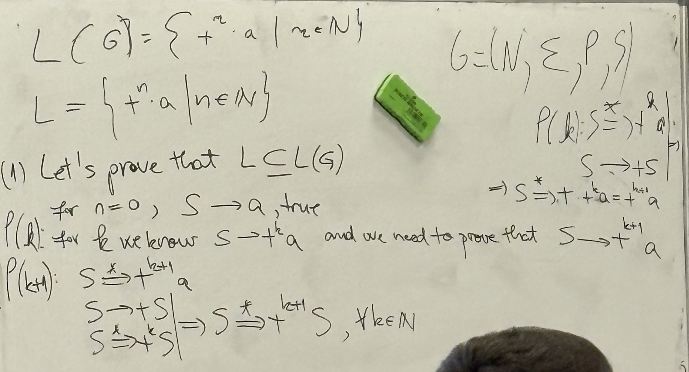
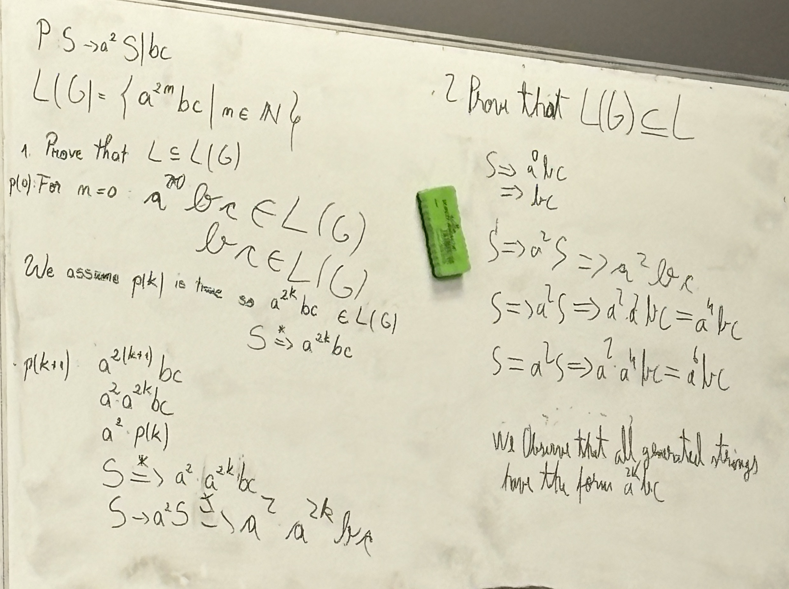
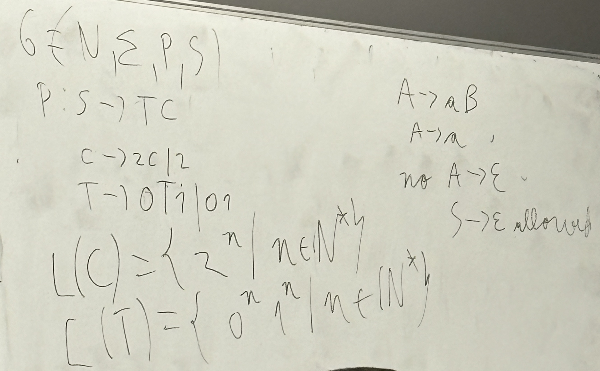

# Seminar 3

G = (N, Σ, P, S)
- N: non-terminals
- Σ: terminals
- P: list of productions
- S: start symbol

### Example
```
S -> aS | ε
=> L(G) = {a^n | n >= 0}
```

### Example 2
```
S -> +S | a
=> L(G) = {+^n a | n >= 0}
```

*Proof:*


### Example 3
Given the grammar:
```
G = {N, Σ, P, S},
    N = {S}
    Σ = {a, b, c}
    P: S -> a^2 S | bc
```
Find L(G).

---
*Solution:*


### Example 4:
Given the grammar:
```
G = {N, Σ, P, S},
    N = {S, C}
    Σ = {a, b}
    P: S -> ab | aCSb
       C -> S | bSb
       CS -> b
```
Prove that `w=ab(ab^2)^2` belongs to L(G).

---
*Proof:*
$$
\begin{align*}
w &= ababbabb \\
\\
S &\rightarrow aCSb \\
    &\rightarrow abSbSb \quad (C \to bSb) \\
    &\rightarrow ababbabb \quad (S \to ab)
\end{align*}
$$

### Example 5:
The language $L = \{0^n 1 0^n | n \ge 0 \}$.
Construct a grammar $G = (N, Σ, P, S)$ that generates L.

---
*Solution:*
$$
N = \{S\}, \\ Σ = \{0, 1\}, \\ P: S \to 0S0 \mid 1
$$

*Proof:*


### Example 6:
Find a grammar that generates $L = \{0^n 1^n 2^m | n, m \in \N^* \}$.

---
*Solution:*
$$
G = (N, Σ, P, S), \\
N = \{S, A\}, \\
Σ = \{0, 1, 2\}
$$
$$
\begin{align*}
P: S &\to TC \\
T &\to 0T1 \mid 01 \\
C &\to 2C \mid 2
\end{align*}
$$

*Proof:*
